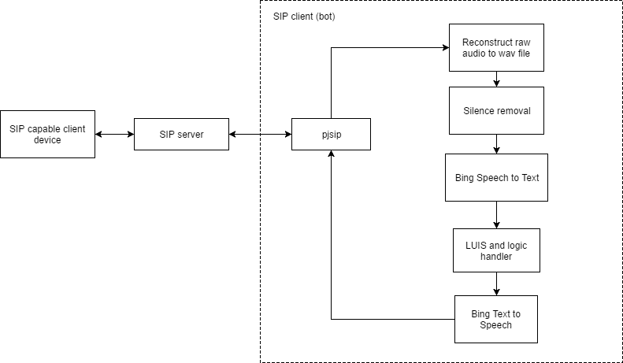

# Using a bot to do VoIP communication using SIP (Session Initiation Protocol)

If you're not clear on how SIP works, please have a read of [this link](https://www.voipmechanic.com/sip-basics.htm). 

#### [Video demo of end result](https://1drv.ms/v/s!AiedmuKgkivNgVq9uZAFujfeGWg3)

The solution works with any SIP client - so if you happen to have a VoIP capable device using SIP, then you'll be able to do this as well. 

**NOTE: This is a proof of concept/demo showing that VoIP communication over SIP is possible between a client and a bot, and is not yet  production ready - the bot only takes one command per call right now (no automatic phrase detection) and does not scale across multiple clients yet (refer to the TODOs section for future work).** 

Here are the steps required:
- **Set up an SIP server.** I set up [Brekeke](http://wiki.brekeke.com/wiki/Brekeke-SIP-Server-v3-Quickstart) (free 60 day trial) in a Windows VM. However, there are always open source solutions that you can explore, such as [OverSIP](http://oversip.net/).
- **Set up an SIP client, which will be your bot.** I used the [python wrapper for pjsip](https://trac.pjsip.org/repos/wiki/Python_SIP_Tutorial), which is an open source library. 
- **Set up Cognitive Services.** This will be used to use LUIS with our bot to understand the user's utterances, as well as use speech to text and text to speech.

The flow is as following:


## Usage

### 1. Setting up the SIP server

When you first [install Brekeke](http://wiki.brekeke.com/wiki/Brekeke-SIP-Server-v3-Quickstart), the interface IP address will be your local IP address. Add the public facing IP address by going to the Configuration page, then filling in the "Interface address 1" field with the public facing IP address of the VM. You'll also need to go into the Azure Portal and configure the security rules for your VM as well to allow traffic from other SIP clients. 

You'll then need to add user accounts so that they can communicate through your server. Make sure the usernames are all numbers. To test that your server is working, install an SIP client app (e.g. AgePhone or CSipSimple) on 2 different phones. In each phone, put in the user credentials and IP address of the VM. You should then be able to call and chat with each other using the app.

### 2. Setting up the SIP client

There are 2 steps to this: 1. Building pjsip libraries (this has to be done in a unix based environment) and 2. Building the python modules. The SIP client was set up in an Ubuntu VM. 

Run the following commands to download and build both pjsip and its python modules (thanks to [this](http://stackoverflow.com/a/30768314) helpful stack overflow answer):

```bash
wget "http://www.pjsip.org/release/2.6/pjproject-2.6.tar.bz2"
sudo apt-get install build-essential python-dev
tar -xf pjproject-2.6.tar.bz2 && cd pjproject-2.6/
export CFLAGS="$CFLAGS -fPIC"
./configure && make dep && make
cd pjsip-apps/src/python/
sudo python setup.py install
```

Copy the files from the src folder to your VM/filesystem (using `scp`). Then run
```bash
python runclient.py
```

Your bot should now be registered with the SIP server and is ready to take calls. You can use an SIP client (e.g. CSipSimple mobile app) to ring the bot. Remember it only listens for the first 10 seconds, so speak your command as soon as the call connects.

## Broken down explanation

We will require the following parts for the bot SIP client:
- PJSIP call module - runclient.py
- File converter module (Will explain later) - convertwav.py
- Silence removal module - clipaudiomodule.py
- Speech to text (STT) module - runspeechrec.py
- Language Understanding (LUIS) module - luismodule.py
- Text to speech (TTS) module - bingttsmodule.py

### PJSIP call module

In here, we start by registering the SIP client with the server. If a call is received, the callback is triggered. The client then waits for 3 seconds before answering the call and starting the wav recorder. The wav recorder listens for 10 seconds before closing the recorder. This is because the rest API for Bing STT takes 10 seconds max. Note that this is a naive implementation of listening to the user's commands and ideally, we should be using the websocket here (future implementation). 

Method to listen then respond:
```python
def listen_and_respond():
    recorderid = lib.create_recorder("YOUR_FOLDER_STRUCTURE/input.wav")
    recorderslot = lib.recorder_get_slot(recorderid)

    # Connect sound device to wav record file
    lib.conf_connect(0, recorderslot)
    lib.conf_connect(callslot, recorderslot)

    # Listen for 8 seconds, naive implementation
    time.sleep(8)

    lib.recorder_destroy(recorderid)
    mybot = bot.BotHelper()
    mybot.generate_response()

    # Play wav file back to user
    playerid = lib.create_player('botresponse.wav',loop=False)
    playerslot = lib.player_get_slot(playerid)
    # Connect the audio player to the call
    lib.conf_connect(playerslot,callslot)

    # Wait for the thing to be read for a few seconds then hang up
    time.sleep(13)
    current_call.hangup()
```

### File converter module

Although pjsip produces a wav file, the properties of the wav file aren't actually properly constructed. Hence, we will need to reconstruct it with the correct properties (PCM, sampling rate of 16000 with wav file type). The soundfile python library was used to stream in the raw audio and reconstruct the wav file. 

Method for reconstruction is as follows:

```python
import soundfile as sf

myfile = sf.SoundFile('input.wav',mode='r',format='RAW',samplerate=16000,channels=1,subtype='PCM_16')

# Reconstruct wav file
sf.write('output.wav',myfile.read(),16000,subtype='PCM_16',format='WAV')
```

### Trimming silence from audio

This part is required because we are doing the naive implementation of STT, where we use the rest API instead of websockets where silence detection is already done for you. Trimming silence from the audio reduces latency and also reduces the risk of us sending more than 10 seconds of audio. You'll need to install the pydub package. 

Method for trimming silence (cheers to [this stack overflow answer](http://stackoverflow.com/a/29550200)):
```python
from pydub import AudioSegment

class AudioTrimmer:

	def detect_leading_silence(self, sound, silence_threshold=-50.0, chunk_size=10):
    		'''
    		sound is a pydub.AudioSegment
    		silence_threshold in dB
    		chunk_size in ms
		
    		iterate over chunks until you find the first one with sound
    		'''
    		trim_ms = 0 # ms
    		while sound[trim_ms:trim_ms+chunk_size].dBFS < silence_threshold:
        		trim_ms += chunk_size
		
    		return trim_ms

	def trim_audio(self,speech_file):
		
		sound = AudioSegment.from_file(speech_file, format="wav")
		
		start_trim = self.detect_leading_silence(sound)
		end_trim = self.detect_leading_silence(sound.reverse())
		
		duration = len(sound)    
		trimmed_sound = sound[start_trim:duration-end_trim]
		
		file_handle = trimmed_sound.export("trimmed.wav", format="wav")
```

### Speech to text, LUIS and Text to speech modules

We used the Bing Speech API to convert the user's utterance into text, LUIS to perform natural language processing on the user's utterance, and then text to speech (from Bing Speech API) to generate a spoken response to be played back to the user. You will need to obtain a Bing Speech API key, instructions on obtaining the key [here](http://www.icomedias.com/support/microsoft-cognitive-services-key/). You can also generate keys for Bing Speech and LUIS straight from the Azure Portal. You will need the key in the authorization header when you make calls to the speech API. Refer to bingspeech.py for the code to make calls to the speech API for speech to text - you will need a specific set of parameters when you make the call. The format of your wav needs to be PCM. Refer to bingttsmodule.py for the calls to speech API for text to speech. 

There is an official [Python SDK for LUIS](https://github.com/Microsoft/Cognitive-LUIS-Python) by Microsoft, which we used to handle the LUIS intents in our code. Just run the following to install it:

```bash
sudo pip install git+https://github.com/Microsoft/Cognitive-LUIS-Python.git
```

You will need to go into the LUIS portal to configure the intents that your bot will understand. Our bot only has the 'GetWeather' and 'GetNews' intents for now. Luismodule.py shows you how to make calls to LUIS, and then handle the intent result from LUIS to generate the bot response to the user. 

## Contributing

Please feel free to make suggestion or a pull request. I am always looking to improve the codebase as it is. 

## TODOs:
- Using the Bing Websocket API, which includes silence detection, etc.
- Abstract out the speech processing
- Figuring out scalability - how to handle multiple calls at once. This could be done by opening a new SIP bot client everytime a call is received from a user, and destroying it upon end of call.
